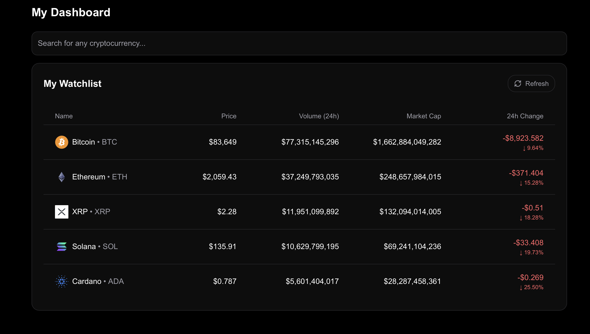

# Crypto Price Tracker

A **real-time cryptocurrency price tracker** built with **Next.js**, featuring live updates for the latest prices of five major cryptocurrencies, **dynamic search and filtering**, and **market insights** like **24-hour price changes** and **daily trading volume**.

## Features:
- **Live Price Updates**: Displays the latest prices for five major cryptocurrencies.
- **Dynamic Search & Filtering**: Quickly find and filter cryptocurrencies by name or symbol.
- **Market Insights**: View helpful details such as **24-hour price change** and **daily trading volume**.
- **Live Refreshing**: The data updates automatically at regular intervals.
-  **CoinGecko API Integration**: Fetches real-time data from the [CoinGecko API](https://www.coingecko.com/en/api).

## Technologies Used
- **JavaScript**: For building the front end and back end of the application.
- **Node.js**: Backend framework to handle server-side logic.
- **React**: For the interactive user interface.
- **React Query**: For easy API integration with caching performance and error handling.
- **Next.js**: Used for the front end of the platform.
- **Tailwind**: Used for dynamic styling in front end interface.
- **Shadcn/ui**: Provided UI components for user interaction.
- **React-bits**: Animated UI components
- **Framer-Motion**: Used to create UI implementation.

## Getting Started

### 1. Clone the Repository
```bash
git clone https://github.com/dabrownies/crypto-price-tracker.git
cd crypto-price-tracker
```
### 2. Clone the Repository
```bash
npm install
# or
yarn install
# or
pnpm install
```

### 3. No API Key required
- CoinGecko's free API allows for simple data fetching without the use of API keys

### 4. Run Development Server
```bash
npm run dev
# or
yarn dev
# or
pnpm dev
```
- Open http://localhost:3000 in your browser.


## Directory Structure
### /app
Defines all of the project's frontend pages.
### /components
Contains UI components and animations.
### /lib
Directory contains API handling and utils.
### /docs-site
Contains all project documentation


### Dashboard Display



